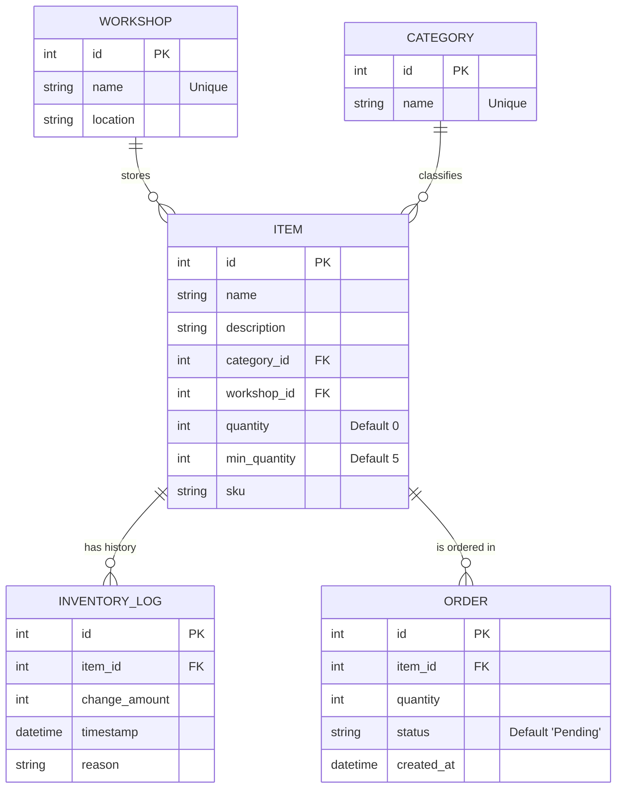

# Database Schema

The application uses **SQLite** with **SQLAlchemy** ORM.

## Entity Relationship Diagram (ERD)

## Tables

### Workshops
Stores physical locations where inventory is kept.
- **id**: Primary Key.
- **name**: Name of the workshop (Unique).
- **location**: Physical address or description.

### Categories
Logical grouping for items.
- **id**: Primary Key.
- **name**: Category name (Unique).

### Items
The core inventory unit.
- **id**: Primary Key.
- **name**: Item name.
- **description**: Optional details.
- **category_id**: Foreign Key to `categories`.
- **workshop_id**: Foreign Key to `workshops`.
- **quantity**: Current stock level.
- **min_quantity**: Threshold for low-stock alerts.
- **sku**: Stock Keeping Unit identifier.

### Inventory Log
An immutable history of stock changes.
- **id**: Primary Key.
- **item_id**: Foreign Key to `items`.
- **change_amount**: Positive (added) or negative (removed) integer.
- **timestamp**: When the change occurred.
- **reason**: User-provided reason (e.g., "New Shipment", "Broken").

### Orders
Tracks replenishment requests.
- **id**: Primary Key.
- **item_id**: Foreign Key to `items`.
- **quantity**: Amount ordered.
- **status**: e.g., "Pending", "Completed".
- **created_at**: Timestamp of order creation.
